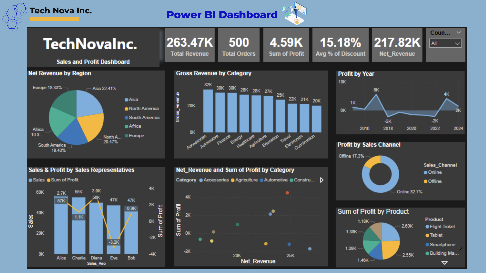

## Overview
Our Analysis provides an overview of TechNova Inc.’s performance over the period of 2015 to 2024 based on the visualizations we created with Power BI.  Our Analysis focuses on sales, profit & operational performances by regions, product category and sales channels to uncover the main drivers of business outcomes. 

## Dashboard
{fig-align="center" width="100%"}

## Key Insights
Strengthen online sales by improving the website and digital marketing.
Raise profitability in weaker regions with better pricing and fewer discounts.
Focus on high-performing products and apply strategies to other categories.
Train sales representatives to turn sales into higher profits.
Plan ahead to keep profits steady and avoid losses.
Use discounts carefully to support sales without affecting margins

## Tools Used
- Power BI Desktop
- Data source: [e.g. Excel, SQL, CSV]

## Conclusion
Throughout the period of analysis, TechNova Inc. has shown greater resilience although revenue and profits were up and down yearly  it looks like the strategy is working recently and recovery is in place.
Based on our analysis, we recommend focusing on high-margin products, accelerating digital transformation, and implementing region-specific strategies. Using data analytics to optimize pricing, forecast demand and manage operations leads to more evidence-driven decisions whilst supporting long-term sustainability and profit objectives.

